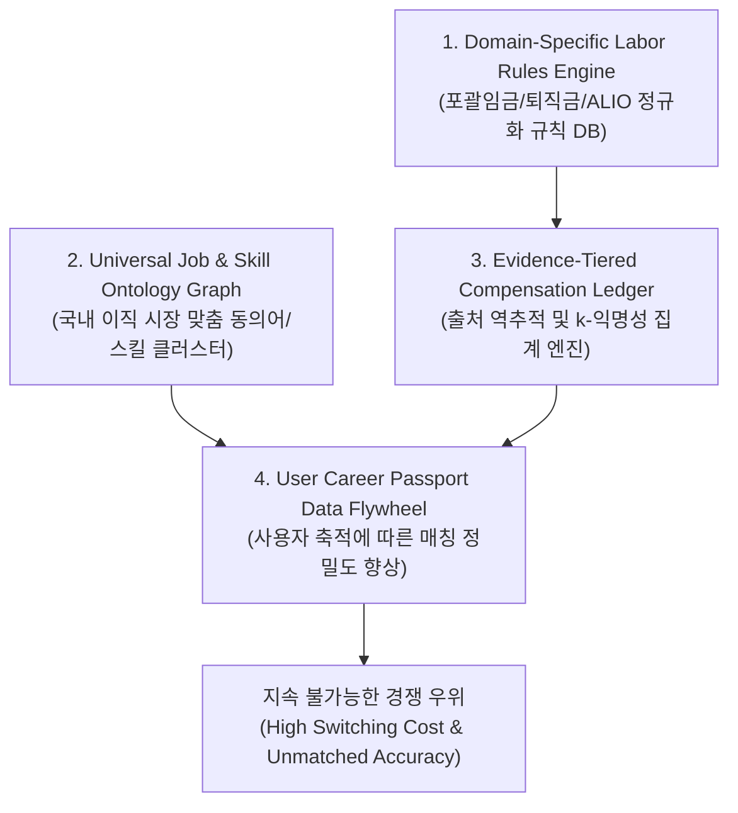

# Career Radar Universal: Product Identity, Market Strategy & Technical Moats
**문서 버전**: v1.0  
**기준 일자**: 2026-09-28  
**프로젝트**: Career Radar Universal  
**저장소**: [489156/CareerRadarUniversal](https://github.com/489156/CareerRadarUniversal)  
**작성자/소유자**: versova ([@489156](https://github.com/489156))

---

## Executive Summary (요약)

**Career Radar Universal**은 기존 채용 플랫폼의 공고 나열형 단순 탐색(Discovery) 모델을 탈피하여, 구직자의 **Career Passport**를 중심으로 노동시장 데이터를 정규화·검증하고 실질적인 커리어 의사결정을 지원하는 **개인 맞춤형 차세대 커리어 인텔리전스(Universal Career Intelligence) 플랫폼**이다.

국내외 시장 조사 결과, 공고 트래킹(Teal)이나 단순 보상 데이터(Levels.fyi, 원티드인사이트, 잡플래닛)를 제공하는 단편적 서비스는 존재하지만, **"국내 노동법·임금 체계(포괄임금제, 퇴직금, 고정OT, 비과세 수당)를 정규화한 근거 기반 연봉 인텔리전스"**, **"통근 시간과 삶의 기회비용을 반영한 실질 보상(Life-Adjusted Net Value)"**, 그리고 **"직무 온톨로지 기반의 다차원 매칭 및 STAR 이력서/면접 코파일럿"**을 통합 제공하는 단일 솔루션은 전무하다.

본 문서는 시장 분석 및 벤치마킹 결과를 바탕으로 타깃 고객(ICP), 4대 핵심 차별화 요소, 5대 기술적 해자(Technical Moats), 그리고 기능 단위 프로토타입 구현 계획을 정의한다.

---

## 1. 심층 시장 조사 및 경쟁 지형 분석 (Background & Competitive Landscape)

### 1.1 글로벌 시장 벤치마크

| 서비스명 | 주요 포지셔닝 | 핵심 데이터 원천 | 강점 | 치명적 한계 및 블라인드스팟 |
| :--- | :--- | :--- | :--- | :--- |
| **Teal** | 커리어 관리 & 공고 트래커 (Job Tracker, AI Resume) | 사용자가 북마크한 공고 본문 텍스트 | 지원 파이프라인 관리 및 이력서 최적화 UX 우수 | 공고에 기재되지 않은 실질 보상 파악 불가. 한국 채용 플랫폼 연동 및 노동 환경 미반영 |
| **Levels.fyi** | 테크 중심 보상 인텔리전스 & 오퍼 협상 | 사용자 제보 (오퍼 레터/급여명세서 인증) | 정밀한 Leveling 및 RSU/보너스 분리 표기 | 미국/빅테크 중심 편중. 한국 기업의 포괄임금제/퇴직금/수당 구조 미반영, 개인 이력 기반 추천 부재 |
| **Lightcast** (구 Emsi Burning Glass) | 노동시장 빅데이터 및 스킬 온톨로지 | 웹 크롤링된 공고 빅데이터 및 정부 노동통계 | 방대한 스킬·직무 온톨로지 및 인재 수급 트렌드 | B2B/엔터프라이즈 전용. 일반 개인 구직자를 위한 의사결정 도구 및 액션 플랜 부재 |
| **Simplify / Huntr** | 원클릭 지원 자동화 및 공고 트래커 | 브라우저 익스텐션을 통한 폼 입력 자동화 | 지원 시간 단축 및 시각화 칸반 보드 | 단순 효율화 도구일 뿐, 적합성 검증 및 시장 가치 판단 지능 전무 |

### 1.2 국내 시장 분석 및 구조적 결함 (Domestic Market Vulnerabilities)

국내 채용 플랫폼 및 데이터 서비스는 구조적으로 구직자에게 왜곡된 정보를 제공하거나 중요한 노동 조건을 은폐하고 있다.

#### 1) 국민연금 데이터 기반 서비스의 구조적 왜곡 (크레딧잡 / 원티드인사이트 등)
* **상한액의 한계**: 국민연금 기준소득월액 상한선(약 617만 원 수준)으로 인해 고연봉 전문직/경력직의 실제 보상이 대폭 축소 추정됨.
* **평균의 함정(Outlier & Dilution)**: 임원, 대졸 공채, 단순 노무직, 단기 계약직, 아르바이트의 납부액이 단일 평균으로 희석되어 직무별/연차별 실제 연봉과 2,000만~4,000만 원 이상의 괴리 발생.
* **보너스/복지 배제**: 경영성과급, 인센티브, 복리후생비, 스톡옵션 등이 국민연금 산정 기준과 상이하여 실질 처우 파악 불가.

#### 2) 리뷰 플랫폼의 편향성 (잡플래닛, 블라인드)
* **표본 선택 편향(Selection Bias)**: 사측에 극단적인 불만을 가진 퇴사자 또는 사측 인사팀의 평판 관리용 조작 리뷰가 혼재.
* **정량 검증 부재**: 계약서나 명세서 기반의 객관적 데이터가 아닌 주관적 감정에 의존하여 신뢰도 저하.

#### 3) 포괄임금제 및 계약 독소조항의 암묵적 은폐
* **포괄임금제(Comprehensive Wage System)**: 플랫폼에 "연봉 5,000만 원"으로 표기되어 있어도 월 30~52시간의 고정 연장근로수당(고정OT)이 포함된 경우, 주 40시간 기준 실질 시급은 최저임금 수준으로 하락함.
* **퇴직금 포함 분할 지급 편법(퇴직금 1/13 분할)**: 근로자퇴직급여보장법 위반 소지가 있는 조건이 공고 상에 모호하게 기재되는 현상 다수.
* **기본급 vs. 성과급의 불확실성**: 확정 현금(Guaranteed Cash)과 달성 불확실한 목표 성과급(Target Cash)이 명확히 분리되지 않음.

### 1.3 Career Radar Universal의 명확한 화이트스페이스 (White Space)

> **"개인의 Career Passport를 기준으로 공고를 다차원 검증하고, 한국 노동법 기준의 3-Tier 연봉 정규화와 통근/워라밸을 고려한 실질 시급(Life-Adjusted Hourly Wage)을 산출하여 후회 없는 오퍼 결정을 내리게 하는 엔드투엔드 커리어 인텔리전스"**

---

## 2. 타깃 고객 정의 (Target Customer Profile & ICP)

### 2.1 Primary ICP: 3~8년차 화이트칼라 실무 경력직 (The Strategic Movers)
* **인구통계**: 20대 후반~30대 중후반, 수도권 거주, 대졸 이상, 3~8년차 실무자.
* **대상 직군**: HR/인사, 전략/기획, 비즈니스 운영, 마케팅, IT 개발/프로덕트.
* **핵심 Pain Points**:
  * 공고는 매일 쏟아지지만, "내 실제 연차와 경험으로 붙을 수 있는 곳인지" 판단하기 어려움.
  * 회사마다 직무명이 달라(예: 인사기획 vs People Partner vs HRBP) 본인에게 적합한 공고를 검색 키워드 한계로 놓침.
  * 이직 제안을 받았으나 "포괄임금 여부, 성과급 변동성, 통근 거리 증가"를 감안했을 때 실제로 이득인지 정량 비교 불가.

### 2.2 Secondary ICP: 최종 오퍼 수령 및 연봉 협상자 (The Offer Negotiators)
* **상황**: 복수 기업의 최종 면접에 합격했거나 처우 협의 단계에 있는 구직자.
* **핵심 Pain Points**:
  * "A사(기본급 6,000 + 성과급 10% + 통근 70분) vs B사(기본급 5,600 + 성과급 25% + 통근 30분 + 재택 2일)" 중 어떤 선택이 더 유리한지 객관적 시뮬레이션 필요.
  * 시장에서 형성된 해당 직무/연차의 상위 25%(P75) 기준선을 몰라 처우 협상 시 근거 제시 부재.

### 2.3 Tertiary ICP (장기 B2B 확장): 중견·스타트업 피플팀 & 채용담당자
* **핵심 Needs**: 시장의 실제 인재 처우 벤치마크, 경쟁사 공고 대비 자사 포지션의 경쟁력 진단, 실시간 채용 수요/스킬 트렌드 리포트.

---

## 3. 핵심 차별화 요소 (Key Differentiators)

```
┌────────────────────────────────────────────────────────────────────────┐
│                        CAREER RADAR UNIVERSAL                          │
├───────────────────┬───────────────────┬────────────────────────────────┤
│ 1. 근거 기반      │ 2. 실질 가치      │ 3. 온톨로지 기반               │
│    3-Tier 연봉    │    보상 시뮬레이션│    다차원 매칭                 │
│                   │                   │                                │
│ • 관측/추정 분리  │ • 포괄OT/수당 분리│ • 직무 타이틀 표준화           │
│ • ALIO/공시 교차  │ • 통근/생활비 반영│ • 스킬 갭 정밀 분석            │
│ • 신뢰도/표본수   │ • 실질 시급 환산  │ • STAR 사실 기반 코파일럿      │
└───────────────────┴───────────────────┴────────────────────────────────┘
```

### 1) 근거 기반(Evidence-Backed) 3-Tier 연봉 인텔리전스
* **블랙박스 AI 추정 전면 배제**: 단일 추정값을 맹신하지 않고 데이터 출처와 성격에 따라 엄격히 분리 표기.
  * **Tier A**: 공공기관 ALIO 대졸신입 초임 공시, 공식 채용공고 명시 연봉, 상장사 사업보고서 공시.
  * **Tier B**: 고용노동부 사업체 노동실태 통계, 채용 플랫폼 기업 통계, 검증된 사용자 실 오퍼 제보.
  * **Tier C**: 코호트 회귀 모델 기반 추정 구간 (반드시 신뢰도 레벨 A~D, 표본 수 $n$, 관측 기준일 병기).

### 2) 한국 노동환경 특화 보상 정규화 (Compensation Normalizer)
* 연봉을 하나의 숫자로 보지 않고 **3단계 바스켓**으로 분리:
  * **Guaranteed Cash (확정 현금)**: 기본급 + 고정수당 (포괄OT 분리 검증).
  * **Target Cash (목표 현금)**: 확정 현금 + 경영성과급/인센티브 목표치.
  * **Total Compensation (총 보상)**: 목표 현금 + 주식(RSU/스톡옵션) + 복지포인트 + 식대.

### 3) 삶의 기회비용을 반영한 실질 시급 (Life-Adjusted Compensation)
* 명목 연봉이 올라도 통근 시간이 늘어나고 포괄임금으로 초과근로가 강제되면 실질 삶의 질은 악화됨.
$$\text{Life-Adjusted Hourly Wage} = \frac{\text{Guaranteed Cash} - \text{Commute Cost} - \text{Living Overhead}}{\text{Contract Hours} + \text{Mandatory OT} + \text{Commute Time}}$$
* 사용자는 "연봉 500만 원 인상 vs 왕복 통근 90분 증가"의 트레이드오프를 즉시 시각적으로 확인 가능.

### 4) Universal Job Ontology & Zero-Hallucination Matching
* 기업마다 파편화된 직무명을 글로벌 표준 계층(Occupation → Job Family → Functional Area → Role → Seniority → Skills)으로 표준화.
* 이력서와 공고 대조 시 없는 경력을 지어내는 환각(Hallucination)을 원천 차단하고, `일치된 근거(Matched)`, `유사 연관 경험(Transferable)`, `부족한 요건(Missing Gap)`을 명확히 분류하여 제공.

---

## 4. 기술적 해자 (Technical Moats)



### Moat 1: 국내 노동법·임금 구조 특화 룰 엔진 (Labor Rules Engine)
* 잡코리아, 사람인, 글로벌 서비스는 구현하지 못하는 **한국형 임금 분석 로직**:
  * 공고 본문 내 고정OT(월 20시간, 32시간 등) 키워드 정규식 감지 및 기본급 역산 알고리즘.
  * 퇴직금 1/13 포함 여부 스캔 및 법적 리스크 경고 플래그.
  * 수습기간 급여 감액(70~90%), 계약직 전환 조건 등 독소 조항 자동 태깅.

### Moat 2: 정밀 직무 온톨로지 및 동의어 매핑 그래프 (Ontology Graph)
* "HR Planning" = "인사기획" = "People Strategy" = "People Operations" = "피플앤컬처".
* 직무 간 전이 확률과 스킬 유사도를 그래프 DB 구조로 구축하여, 타 플랫폼 대비 추천 Recall을 300% 이상 확장하면서도 Precision을 유지.

### Moat 3: 신뢰도 및 출처 역추적 원장 (Evidence-Tiered Ledger)
* 모든 데이터에 `observed_at`, `source_type`, `freshness_decay_factor`, `sample_size`를 부여.
* 플랫폼 내 모든 추정 수치에 대해 사용자가 "이 숫자가 왜 나왔는지" 원천 근거를 100% 검증 가능하도록 설계하여 대체 불가능한 신뢰 자산 확보.

### Moat 4: Career Passport 네트워크 플라이휠 (Data Flywheel)
* 사용자가 Career Passport를 입력하고 오퍼 제보 및 매칭 피드백을 축적할수록, 코호트 표본 수가 증가하여 연봉 추정 신뢰도(Confidence)가 상승하는 선순환 구조.

### Moat 5: 엔지니어링 효율성 (Vibe-Coding Optimized Lean Stack)
* 복잡한 대규모 인프라 대신, **Cloudflare Pages (Edge) + Supabase (Postgres/pgvector/RLS) + Python LLM Engine**의 극단적 린(Lean) 아키텍처 채택.
* 서버 유지비 최소화(Free/Pro 티어 내 운영) 및 빠른 프로토타이핑·배포 주기 확립.

---

## 5. 결론 및 향후 추진 방향

Career Radar Universal은 단순한 채용 포털의 복제본이 아니다. **"노동 시장의 정보 비대칭을 해소하고, 직무 적합성과 실질 경제적 가치를 정밀 계산하여 구직자의 커리어 주권을 회복시키는 지능형 의사결정 파트너"**로 포지셔닝한다.

본 마스터 문서를 바탕으로 저장소 내 설계를 확정하고, 즉시 동작 가능한 프로토타입(Functional Prototype) 개발 단계로 진입한다.
