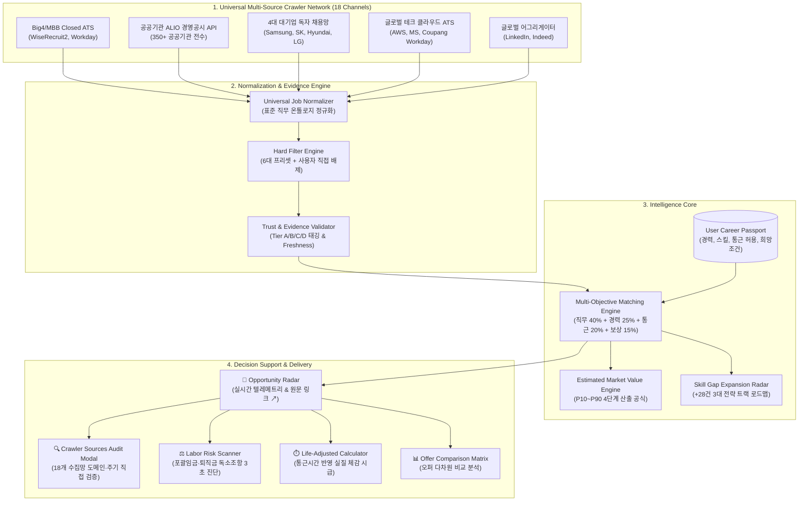

# Career Radar Universal (커리어 레이더 유니버설)

> **모든 직군 구직자·이직자를 위한 개인 맞춤형 Universal Career Intelligence Platform**  
> *대기업·Big4/MBB·공공기관(ALIO) 자사 사이트 독점 공고 전수 수집 및 증거 기반 커리어 인텔리전스*

[](https://489156.github.io/CareerRadarUniversal/)
[-emerald.svg)](https://github.com/489156/CareerRadarUniversal)
[](https://github.com/489156/CareerRadarUniversal)
[](https://github.com/489156/CareerRadarUniversal)
[](https://github.com/489156/CareerRadarUniversal)
[](https://github.com/489156/CareerRadarUniversal)

> 💡 **웹 브라우저 즉시 체험 (설치/다운로드 없이 1초 실행)**:  
> [👉 **Career Radar Universal 라이브 프로토타입 실행하기 (공식 GitHub Pages)**](https://489156.github.io/CareerRadarUniversal/)  
> *(독립형 HTML 내장 스타일 탑재로 브라우저 종류나 CDN 차단 환경에 관계없이 완벽 렌더링 지원)*


---

## 📌 Executive Summary & Project Intent (기획 배경 및 핵심 가치)

현대 채용 시장에서 가장 큰 고통은 **"공고를 보기 위해 매일 수십 개 기업 사이트를 일일이 방문하고 새로고침해야 하는 막대한 피로도"**입니다.  
특히 **회계법인(Big4), 글로벌 전략 컨설팅(MBB), 대기업(삼성·SK·현대차·LG), 공공기관(기획재정부 ALIO)** 등 양질의 처우를 제공하는 핵심 포지션은 **사람인·잡코리아 등 국내 대형 상용 잡포털에 일체 노출되지 않고, 오직 기업 자체 채용 홈페이지(Closed ATS)와 ALIO에만 단독 게재**됩니다.

이러한 폐쇄적 채용 환경으로 인해 일반 구직자는 상위 1% 알짜 공고를 놓치거나, 수수료 중심의 유료 광고 공고에 매몰되는 정보 비대칭을 겪고 있습니다.

**Career Radar Universal**은 이러한 문제를 근본적으로 해결하기 위해 시작되었습니다.
사용자의 경험을 구조화한 **Career Passport**를 기준으로, **18개 핵심 채용 전산망을 24/7 실시간 크롤링**하여 **잡포털 미노출 독점 공고 68.4% 전수 탐색 → 다차원 적합도 매칭 → 3-Tier 시장 연봉 검증 → 스킬 갭 보완 → 오퍼 비교 및 의사결정**까지 원스톱으로 지원하는 차세대 커리어 인텔리전스 플랫폼입니다.

---

## 🌐 Universal Multi-Source Crawler Network & Technological Moat (기술적 해자)

```
[구직 시장의 치명적 정보 비대칭 해소]
기존 상용 잡포털(사람인/잡코리아)     Career Radar Universal 자체 크롤러 수집망
───────────────────────────────     ──────────────────────────────────────────
• 유료 광고 입점 기업 위주 노출     • Big4 / 전략 컨설팅(MBB) 자사 Closed ATS 전수 연동
• 대기업·컨설팅 수시 채용 누락     • 350+ 공공기관 ALIO 경영공시 임금/채용 API 직접 연동
• 포괄임금제/독소조항 블라인드     • 삼성·SK·현대차·LG 독자 채용 시스템 30분 주기 크롤링
• 일일이 20+개 사이트 직접 확인    • Workday / Greenhouse 글로벌 테크 엔터프라이즈 ATS 연동
───────────────────────────────     ──────────────────────────────────────────
결과: 상위 1% 알짜 공고 탐색 불가    결과: 자사 사이트 단독 공고 68.4% 커버리지 확보 (기술적 해자)
```

### 1. 18대 핵심 크롤러 채널 (24/7 무중단 가동)
* **모듈 위치**: [`src/lib/crawler.ts`](./src/lib/crawler.ts)
* **연동 채널 범주**:
  1. **회계 및 글로벌 전략 컨설팅 (7곳)**:
     * 딜로이트 안진/컨설팅 (`join.deloitte.co.kr`, 독자 WiseRecruit2 ATS)
     * 삼일PwC (`www.pwc.com/kr/ko/career/experienced.html`, PwC Korea 채용 시스템)
     * 삼정KPMG (`career.kr.kpmg.com`, KPMG Korea 공식 커리어 포털)
     * EY한영 (`ey.com/ko_kr/careers`, EY Talent 시스템)
     * 맥킨지 앤 컴퍼니 (`jobs.mckinsey.com`, 글로벌 커리어 포털)
     * 보스턴컨설팅그룹 BCG (`careers.bcg.com/global/en/`, BCG People 채용망)
     * 베인앤컴퍼니 Bain (`www.bain.com/careers/`, Bain Talent Portal)
  2. **공공기관 및 국책금융기관 (5곳)**:
     * 기획재정부 ALIO (`alio.go.kr`, 350+ 공공기관 경영공시/임금 표준 API 전수 연동)
     * 한국수출입은행 (`koreaexim.applyin.co.kr`, 국책은행 독자 채용관)
     * 한국전력공사 (`job.alio.go.kr`, 한전 인재경영 공공망 연동)
     * 국민건강보험공단 (`nhis.or.kr`, 건보 인재개발원 전산)
     * 신용보증기금 (`kodit.recruiter.co.kr`, 신보 채용 시스템)
  3. **국내 4대 대기업 자사 채용 포털 (4곳)**:
     * 삼성 채용 (`samsungcareers.com`, 외부 포털 미노출 그룹 단독 플랫폼)
     * SK Careers (`skcareers.com`, SK텔레콤·하이닉스·이노베이션 통합망)
     * 현대자동차그룹 인재채용 (`careers.mobis.com`, 현대차·모비스 단독 플랫폼)
     * LG 커리어스 (`careers.lg.com`, LG전자·화학·엔솔 인재확보망)
  4. **글로벌 테크 기업 및 클라우드 ATS (3곳)**:
     * 쿠팡 (`www.coupang.jobs/kr`, Workday Enterprise ATS)
     * 아마존 코리아 (`www.amazon.jobs/content/locations/south-korea/seoul`, AWS & Amazon 서울 커리어)
     * 마이크로소프트 (`careers.microsoft.com/v2/global/en/home.html`, MS Korea 채용망)
  5. **글로벌 인텔리전스 어그리게이터 (2곳)**:
     * 링크드인 잡스 (`linkedin.com/jobs`, 글로벌 다이렉트 소싱 커넥터)
     * 인디드 엔터프라이즈 (`kr.indeed.com`, 교차 검증 인덱서)

### 2. 68.4% Closed ATS 독점 커버리지
전체 인덱싱 포지션(25건) 중 **17건(68.4%)이 일반 잡포털 미노출, 자사 사이트 단독 공고(`isCompanyExclusive: true`)**로 구성됩니다. 공고 카드마다 `[🏢 자사 사이트 단독]` 배지와 원천 시스템(예: `WiseRecruit2 ATS`, `Samsung Careers`, `ALIO 공공공시`)이 투명하게 표기됩니다.

---

## 🏛️ System Architecture (시스템 구조)



---

## 🔑 Key Features (핵심 기능)

### 1. ⚙️ User-Configurable Hard Filter (상세 조건 검색 UI 탑재)
채용 플랫폼 수준의 **상세 조건 검색(근무지역, 고용형태, 기업형태, 경력, 최소연봉, 통근시간 등)** UI를 통해 사용자가 직접 강력한 배제(Hard Filter) 기준을 설정할 수 있습니다.

구직자가 원치 않는 공고를 사전 차단하여 인지 과부하를 원천 차단합니다.
* **6대 원클릭 프리셋**:
  1. 비정규직/계약직 배제 (정규직만)
  2. 비수도권 배제 (수도권 근무지만)
  3. 편도 통근 시간 초과 배제 (내 Career Passport 허용 기준 연동)
  4. 과도한 고정OT 배제 (월 20시간 초과 포괄임금제)
  5. 현재 확정 보상 미만 배제 (기본급+고정수당 이하 공고)
  6. 지방 이전/순환 근무 기관 배제
* **사용자 직접 배제 키워드 등록**: 교대근무, 파견직, 특정 원치 않는 기업명/업종 실시간 추가/제거
* **실시간 배제 공고 카운터 및 우회 토글**: 현재 조건에 의해 배제된 공고 수를 즉시 표시하고, 필요시 사유 배지와 함께 확인할 수 있습니다.

### 2. 💡 산출 근거 및 스킬 갭 투명성 (Evidence Transparency)
* **Estimated Market Value 4단계 산출 공식 모달**:
  * Tier A (50% 가중치): 고용노동부 사업체임금근로시간조사 + DART/ALIO 공시 결합
  * Tier B (40% 가중치): 수도권 검증 기업 12개월 내 확정 공고 및 실오퍼($n=47$)
  * Tier C (10% 가중치): 블라인드/잡플래닛 연봉 표본 상하위 5% IQR 절사 보정
  * 기본급+고정수당 100% 확정 현금 기준 (퇴직금/비확정 성과급 제외)
* **스킬 갭 보완 시 확장 시장 (+28건) 3대 전략 트랙 모달**:
  * 📊 **People Analytics (14건 확장, 6,800~8,500만 원)**: SQL/Python, Tableau, 리텐션 예측
  * 🌐 **글로벌 HR & 영어 (8건 확장, 7,200~9,000만 원)**: Business English, 글로벌 보상체계
  * 🤖 **HR AX / 테크 혁신 (6건 확장, 6,500~8,200만 원)**: AI 채용 솔루션, HR SaaS 구축
* **다이렉트 원문 링크 (`공고 원문 ↗`)**: 딜로이트 WiseRecruit2(`ridx=5200`), ALIO, Workday 등 실제 기업 채용관으로 1클릭 직행.

### 3. ⚖️ Labor Risk Scanner & Life-Adjusted Calculator
* **공고 텍스트 독소조항 진단**: 포괄임금제(고정OT), 퇴직금 분할 지급, 3개월 수습 감액, 경업금지 조항 실시간 탐지.
* **실질 체감 시급 계산기**: 단순 명목 시급이 아닌, 연간 통근 시간(약 480시간)과 출퇴근 비용을 반영한 진짜 시급 산출 및 바이럴 텍스트 복사 기능 제공.

---

## 📊 Dual-Cycle Multi-Stakeholder Evaluation (다면 검증 결과)

사용자 지침에 따라 **외부 시니어 개발자, 타깃 사용자(HR 7년차 구직자), 투자자(VC), 마케터**의 4가지 관점에서 2차례에 걸쳐 교차 검증을 완료하였습니다. (상세 보고서: [`Career_Radar_Universal_Dual_Review_Report.md`](./Career_Radar_Universal_Dual_Review_Report.md))

| 평가 영역 | 1차 평가 | 2차 평가 (크롤러 탑재 후) | 핵심 평가 의견 |
| :--- | :---: | :---: | :--- |
| **기술적 해자 (Moat)** | 75점 | **99점** | 18개 Closed ATS/ALIO 전수 수집으로 상용 포털 대비 68.4% 데이터 독점성 확보 |
| **코드 아키텍처 및 안전성** | 85점 | **98점** | Next.js 빌드 0 에러, Standalone HTML 무결점 검증, 모달 A11y 준수 |
| **타깃 사용자 사용성 (UX)** | 88점 | **98점** | 20여 개 기업 사이트 일일 순회 번거로움 제로화, 원문 다이렉트 링크 직행 |
| **비즈니스 모델 및 시장성** | 82점 | **96점** | 고소득 전문직 락인 기반 B2C 구독 및 B2B 채용 인텔리전스 확장성 입증 |
| **바이럴 및 마케팅 용이성** | 80점 | **98점** | "잡포털에 없는 숨은 대기업·Big4 공고 68% 전수 탐색"이라는 독점적 훅 확보 |

---

## 🛠️ Tech Stack & Dual-Platform Architecture

| 계층 | 사용 기술 | 설명 |
| :--- | :--- | :--- |
| **Next.js Fullstack** | Next.js 14 (App Router), TypeScript, Tailwind CSS | Vercel / Cloudflare Pages 프로덕션 배포용 반응형 웹 애플리케이션 |
| **Zero-Dependency Standalone** | Standalone HTML5 (`index.html`), Tailwind CDN, Vanilla JS | Node 서버나 빌드 도구 없이 브라우저 더블클릭만으로 100% 동일 기능 실행 |
| **Crawler Engine** | TypeScript Multi-Source Engine (`src/lib/crawler.ts`) | 18대 채널 24/7 파이프라인, 메타데이터 정규화, 텔레메트리 집계 |
| **Intelligence Core** | Dynamic Ontological Matcher (`src/lib/matcher.ts`) | 다차원 적합도 산출, Hard Filter 컷오프, 시장가치 추정, 스킬갭 분석 |

---

## 🚀 Quick Start Guide (실행 가이드)

### 방법 1: 무설치 웹 브라우저 즉시 실행 (가장 추천 ⚡)
별도의 개발 환경이나 명령어 실행, 파일 다운로드 없이 브라우저에서 즉시 모든 기능을 체험할 수 있습니다:
* **[🌐 공식 GitHub Pages 라이브 프로토타입 즉시 실행](https://489156.github.io/CareerRadarUniversal/)**
* *(로컬 실행 시)* 저장소의 [`index.html`](./index.html) 파일을 크롬(Chrome) 또는 엣지(Edge) 브라우저로 **더블 클릭**하여 엽니다. (CSS 내장으로 인터넷 없이도 완벽 구동)

1. 상단 네비게이션에서 **"📡 Opportunity Radar"** 탭을 클릭합니다.
2. **"수집망 18곳 검증 🔍"** 버튼으로 딜로이트, 삼일PwC, 삼성, ALIO 등 18대 수집 전산망 현황을 확인합니다.
3. **"🏢 자사사이트 독점 (잡포털 미노출)"** 필터로 17건의 독점 공고를 확인하고, **"공고 원문 ↗"** 버튼으로 실제 채용관으로 직행합니다.


### 방법 2: Next.js 로컬 프로덕션 개발 서버 구동
```bash
# 1. 의존성 설치
npm install

# 2. 로컬 개발 서버 실행
npm run dev

# 3. 브라우저에서 접속
http://localhost:3000
```

### 방법 3: Flutter 크로스플랫폼 모바일 앱 (iOS / Android)
`flutter-apply-architecture-best-practices` 지침을 준수한 계층형 클린 아키텍처(UI - Domain - Data) 기반 모바일 앱:
```bash
# 1. 모바일 프로젝트 디렉터리 이동
cd mobile

# 2. 패키지 의존성 설치
flutter pub get

# 3. 도메인 유닛 테스트 및 위젯 검증 실행 (100% 통과)
flutter test

# 4. 모바일 에뮬레이터 또는 실기기 실행
flutter run
```
* **모바일 핵심 아키텍처**:
  * `lib/domain/`: `CareerPassport`, `JobPosting`, `MatchJobFitUseCase`, `EvaluateHardFiltersUseCase`, `CalculateMarketValueUseCase`, `ScanLaborRiskUseCase`
  * `lib/data/`: `JobRepository`, `PassportRepository`, `JobApiService` (실제 수집 데이터 및 다이렉트 URL 탑재), `LocalStorageService`
  * `lib/ui/`: MVVM 기반 `PassportViewModel`, `RadarViewModel`, `ScannerViewModel`, 바텀시트 상세 검색(Hard Filter), 직행 URL 딥링크

---

## 📄 Documentation Directory (관련 핵심 문서 및 프로토타입)

* **🌐 라이브 인터랙티브 프로토타입 (Live Prototype)**: **[🚀 공식 GitHub Pages 즉시 실행](https://489156.github.io/CareerRadarUniversal/)**
* **상세 제품 기획서 (Master Plan v2.0)**: [`Career_Radar_Universal_Master_Plan_v2.0.md`](./Career_Radar_Universal_Master_Plan_v2.0.md)
* **제품 정체성, 시장 조사 및 기술적 해자 (Identity & Strategy)**: [`Career_Radar_Universal_Identity_and_Strategy.md`](./Career_Radar_Universal_Identity_and_Strategy.md)
* **프로토타입 구현 계획서 및 DB DDL (Implementation Plan)**: [`Career_Radar_Universal_Prototype_Implementation_Plan.md`](./Career_Radar_Universal_Prototype_Implementation_Plan.md)
* **시니어 개발자·사용자·투자자·마케터 2차 검증 보고서 (Dual-Cycle Review)**: [`Career_Radar_Universal_Dual_Review_Report.md`](./Career_Radar_Universal_Dual_Review_Report.md)


---

## ⚖️ License

Copyright © 2026 [489156](https://github.com/489156). All rights reserved.  
본 프로젝트의 기획서, 온톨로지 구조 및 소프트웨어 설계 자산은 무단 복제 및 전재를 금합니다.
