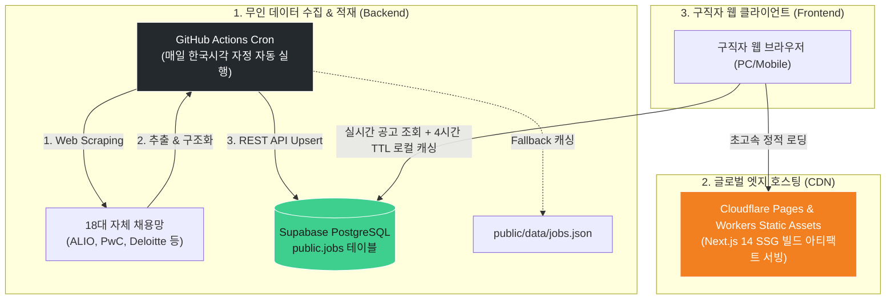
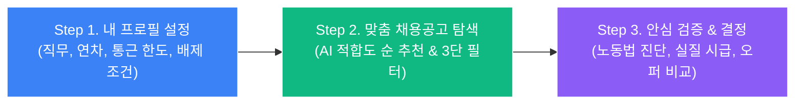

# 🎯 Career Radar Universal (커리어 레이더 유니버설)

> **대기업·공공기관(ALIO)·Big4 자체 ATS 독점 채용공고 무인 수집 및 다차원 커리어 인텔리전스 플랫폼**  
> *Zero-CLI 기반 완전 무인 데이터 파이프라인 & Cloudflare Edge 엣지 배포 아키텍처*

[-emerald.svg?style=for-the-badge)](https://github.com/489156/CareerRadarUniversal)

---

## 📌 1. Executive Summary & Project Intent (기획 배경)

현대 채용 시장의 가장 큰 정보 비대칭은 **"양질의 알짜 공고일수록 대형 잡포털(사람인, 잡코리아)에 올라오지 않는다"**는 점입니다.  
- **350+ 공공기관 및 국책금융기관**: 기획재정부 ALIO 경영공시 시스템에만 정규직 채용이 단독 게재됩니다.
- **주요 대기업(삼성, 현대차, SK, LG)** 및 **회계/전략컨설팅(Big4/MBB)**: 수수료 기반 포털을 배제하고 자사 채용 홈페이지(Closed ATS)만을 통해 수시 채용을 진행합니다.

구직자는 이 알짜 공고들을 확인하기 위해 매일 수십 개의 기업 사이트를 일일이 방문해야 하는 극심한 탐색 피로를 겪고 있습니다.

**Career Radar Universal**은 이 문제를 종결하기 위해 탄생했습니다.  
사용자의 경력과 거주지 기준을 담은 **Career Passport**를 바탕으로, **18대 독자 채용 전산망을 매일 무인 크롤링**하여 **잡포털 미노출 독점 공고 전수 탐색 ➔ 다차원 AI 적합도 매칭 ➔ 기업 Tier별 코호트 연봉 검증 ➔ 노동법 독소조항 감별 ➔ 실질 체감 시급 계산**까지 원스톱으로 제공하는 차세대 커리어 의사결정 플랫폼입니다.

---

## 🏛️ 2. End-to-End 시스템 아키텍처 & 무인 파이프라인

본 서비스는 운영자의 수동 개입이 전혀 필요 없는 **Zero-CLI, Zero-Cost 3각 무인 파이프라인**으로 작동합니다.

🚀 **최신 아키텍처 업데이트**: 단일 파일(Monolithic) 뷰 구조에서 벗어나, **Zustand 전역 상태 관리**를 도입하고 모든 거대 팝업 모달을 독립 컴포넌트(`src/components/`)로 100% 분리하는 대규모 리팩토링을 완료했습니다. 데이터 패칭 로직 또한 하드코딩 Mock 데이터에서 **Supabase 실시간 연동**으로 전환되었습니다.

### 아키텍처 3대 안정성 안전망
1. **SSG + Client-side Hydration 하이브리드**: Cloudflare 엣지에서 초고속 정적(SSG) 파일로 즉시 열리고, 브라우저 마운트 직후 Supabase에서 실시간 채용 공고를 땡겨옵니다.
2. **Supabase 무료 쿼터 방어 (4시간 TTL Caching)**: 매 접속마다 DB를 호출하지 않고 브라우저 `localStorage`에 4시간 단위로 캐싱하여 무료 티어 트래픽 한도를 원천 방어합니다.
3. **2중 Fallback 안전망**: 사용자가 DB 키를 아직 넣지 않았거나 서버 장애 발생 시, 내장된 `MOCK_JOB_DATABASE`로 즉시 우회하여 사이트가 절대 뻗지 않습니다.

---

## 🎯 3. 핵심 혁신 엔진 (Technological Moats)

### ① 다차원 코호트 시장가치 매트릭스 (Multi-dimensional Cohort Engine)
단순 선형 연차 계산을 탈피하고, 신입 대졸 초임부터 극심하게 양극화되는 대한민국 노동시장 현실을 수학적으로 모델링했습니다.
* **Tier 1 (빅테크/유니콘, 1.40x)**: 초봉 6,000만 원~, 가파른 성장률
* **Tier 2 (주요 대기업, 1.25x)**: 초봉 5,000만 원~, 안정적 호봉 상승
* **Tier 3 (금융/공공기관, 1.15x)**: ALIO 공시 기준 확정 초임
* **Tier 4 (스타트업/중소, 1.00x)**: 고용노동부 사업체 임금통계 기준선

### ② 강력한 스마트 절대 배제 필터 (Hard Filter)
구직자가 원치 않는 공고를 사전에 완전히 걸러내는 엄격한 방어막입니다.
* **6대 원클릭 프리셋**: 정규직만 허용(계약/파견 컷), 수도권만 허용(지방 컷), 통근 한도 초과 컷(예: 60분 초과), 고정OT 20시간 초과 컷(과도한 포괄임금), 현재 보상 미만 컷, 지방 이전 기관 컷
* **사용자 직접 배제 키워드**: 교대근무, 현장직, 인턴 등 단어를 등록하면 해당 공고를 즉각 숨김 처리.

### ③ ⚖️ 노동법·독소조항 안심 진단기 (Labor Risk Scanner)
공고 원문이나 근로계약서 문구를 붙여넣으면 3초 만에 노동법 리스크를 감별합니다.
* **포괄임금제 고정OT 시간 적발**, **퇴직금 분할 지급 약정**, **위법한 수습기간 감액(최저임금 미달 여부)**, **불공정 경업금지 조항** 자동 진단 및 경고.

### ④ 💰 삶의 시간 반영 '실질 체감 시급' 계산기 (Life-Adjusted Value)
겉으로 보이는 명목 연봉의 착시를 걷어냅니다.
* 연간 길바닥에 버리는 **통근 시간(평균 400~500시간)**과 대중교통비, 주당 실근로시간, 재택근무 일수를 종합 감가상각하여 **내 통장에 꽂히는 진짜 시간당 가치**를 산출합니다.

---

## 📱 4. 서비스 이용법 (User Journey)

구직자가 서비스를 활용하여 최종 이직 결정을 내리는 3단계 흐름입니다.

1. **`🪪 내 커리어 프로필`**:
   - 신입/경력 트랙을 선택하고, 표준 직무(HR, 기획, 개발, 재무, 마케팅)와 현재 보상, 거주지를 입력합니다.
   - 내가 절대 갈 수 없는 조건(지방 근무, 파견직 등)을 배제 조건으로 등록합니다.
2. **`📡 맞춤 채용공고`**:
   - 내 프로필과 실시간 매칭된 공고들이 **AI 적합도(FIT SCORE, %)** 순으로 정렬됩니다.
   - [🏢 직군 / 🏛️ 기업유형 / ✨ 핵심조건] 필터로 원하는 공고만 추려내고, `지원 원문 ↗` 버튼으로 기업 자체 채용관으로 직행합니다.
3. **`⚖️ 안심 진단` & `💰 실질 시급 계산기`**:
   - 마음에 드는 공고의 노동법 리스크를 검증하고, 통근 시간을 감안했을 때 이직할 가치가 있는지 실질 시급을 계산합니다.
   - 복수 합격 시 `📊 합격 오퍼 비교` 표에서 삶의 질을 비교하여 최종 입사를 결정합니다.

---

## 🛠️ 5. 완전 무인 환경 세팅 가이드 (Zero-CLI)

복잡한 개발 도구 설치 없이, 웹 브라우저에서 3가지만 연동하면 서비스가 영구 자동 가동됩니다.

### Step 1. 데이터베이스 생성 (Supabase)
1. [Supabase](https://supabase.com/) 대시보드에서 New Project를 생성합니다.
2. 좌측 메뉴 **SQL Editor**로 이동하여 본 저장소의 [`supabase_schema.sql`](./supabase_schema.sql) 파일 내용을 붙여넣고 **Run**을 누릅니다. (테이블 및 보안 세팅 1초 완성)
3. **Project Settings ➔ API**에서 `Project URL`과 `anon public key`를 복사해 둡니다.

### Step 2. 크롤러 연동 (GitHub Actions)
1. 본 GitHub 저장소의 **Settings ➔ Secrets and variables ➔ Actions**로 이동합니다.
2. **New repository secret**을 눌러 아래 2개를 등록합니다:
   - `SUPABASE_URL`: (복사한 Supabase URL)
   - `SUPABASE_ANON_KEY`: (복사한 anon public key)
   - *➔ 매일 한국 시각 자정에 GitHub Actions가 무인으로 돌아가며 DB를 갱신합니다.*

### Step 3. 프론트엔드 연동 (Cloudflare Pages)
1. [Cloudflare](https://dash.cloudflare.com/) 대시보드 ➔ Workers & Pages ➔ CareerRadarUniversal 프로젝트로 들어갑니다.
2. **Settings ➔ Builds ➔ Variables and secrets**에 아래 2개를 등록합니다:
   - `NEXT_PUBLIC_SUPABASE_URL`: (Supabase URL)
   - `NEXT_PUBLIC_SUPABASE_ANON_KEY`: (anon public key)
3. 저장 후 **Deployments ➔ Retry build**를 누르면 끝납니다.

---

## 💻 6. 기술 스택 (Tech Stack)

| 계층 | 기술 스택 | 설명 |
|---|---|---|
| **Frontend Framework** | **Next.js 14 (App Router)** | TypeScript 기반의 모던 웹 아키텍처, `output: 'export'` SSG 모드 |
| **State Management** | **Zustand** | 단일 전역 스토어(`useAppStore`) 기반의 초경량/고성능 상태 관리 및 UI 컴포넌트 모듈화 |
| **Styling & Design** | **Tailwind CSS 3.4** | Vercel / Linear 감성의 모던 Slate 다크 테마 |
| **Edge Hosting** | **Cloudflare Pages / Workers** | 글로벌 엣지 무비용 초고속 정적 배포 (`wrangler.toml` assets 규격) |
| **Backend & BaaS** | **Supabase (PostgreSQL)** | REST API 통신, RLS 보안 정책, 브라우저 4시간 TTL 로컬 캐싱 |
| **Automated Crawler** | **GitHub Actions Cron + Cheerio** | 매일 자정 18대 채널 무인 스크래핑 및 Supabase Upsert |

---

## 📄 Documentation Directory

* **시스템 아키텍처 구현 계획서**: [`Career_Radar_Universal_Prototype_Implementation_Plan.md`](./Career_Radar_Universal_Prototype_Implementation_Plan.md)
* **제품 전략 및 정체성 분석**: [`Career_Radar_Universal_Identity_and_Strategy.md`](./Career_Radar_Universal_Identity_and_Strategy.md)
* **상세 기획서 v2.0**: [`Career_Radar_Universal_Master_Plan_v2.0.md`](./Career_Radar_Universal_Master_Plan_v2.0.md)
* **데이터베이스 스키마 DDL**: [`supabase_schema.sql`](./supabase_schema.sql)

---

## ⚖️ License
Copyright © 2026 [489156](https://github.com/489156). All rights reserved.  
본 프로젝트의 비즈니스 로직, 온톨로지 구조 및 소프트웨어 설계 자산은 무단 복제 및 전재를 금합니다.
