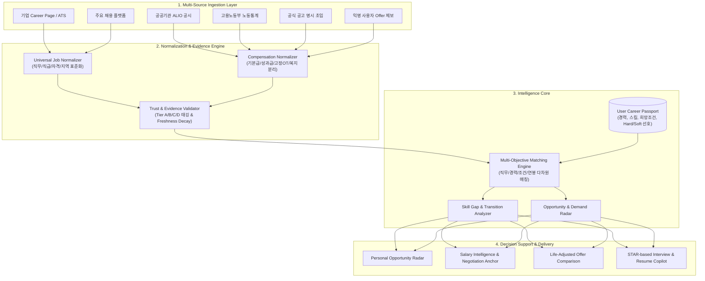

# Career Radar Universal (커리어 레이더 유니버설)

> **모든 직군 구직자·이직자를 위한 개인 맞춤형 Universal Career Intelligence Platform**  
> *Moving beyond simple job discovery to evidence-based career intelligence and decision-making.*

---

## 📌 Executive Summary (개요)

현대 채용 시장의 핵심 문제는 **"공고의 절대적 부족"**이 아니라, **"나에게 의미 있는 기회의 선별과 조건의 불확실성"**입니다.  
기존 채용 플랫폼(원티드, 사람인, 잡코리아, 링크드인, 리멤버 등)은 단순히 공고를 보여주는 **검색(Discovery)** 단계에 머물러 있어, 구직자는 다음과 같은 본질적인 질문에 스스로 답해야 했습니다.

* *"내 경력과 스킬셋으로 실제로 합격 가능한 포지션인가?"*
* *"비슷해 보이는 공고 중 내 이력에 실질적으로 유리한 곳은 어디인가?"*
* *"이 회사가 제시하거나 시장에서 형성된 적정 연봉과 보상 패키지는 얼마인가?"*
* *"합격을 위해 지금 당장 보완해야 할 스킬 갭(Skill Gap)은 무엇인가?"*
* *"통근 시간, 복리후생, 고정OT, 계약 조건을 고려한 '실질 가치(Life-Adjusted Value)'는 얼마인가?"*

**Career Radar Universal**은 사용자의 경험을 체계적으로 구조화한 **Career Passport**를 기준으로 노동시장 전체 데이터를 실시간 매핑하여, **공고 탐색 → 적합성 검증 → 시장 연봉 분석 → 스킬 갭 보완 → 오퍼 비교 및 의사결정**까지 전 과정을 단일 루프로 연결하는 차세대 커리어 인텔리전스 플랫폼입니다.

---

## 🎯 Project Thesis & Core Philosophy (기획 의도 및 철학)

### 1. Discovery 중심에서 Decision 중심으로
기존 플랫폼이 "더 많은 공고를 스크롤하게 만드는 것"을 목표로 한다면, **Career Radar**는 **"구직자의 의사결정 비용을 최소화하고, 후회 없는 커리어 전환을 지원하는 것"**을 궁극적 목표로 합니다.

```
[기존 플랫폼]  공고 나열 (Discovery) ───────> 구직자가 수작업 선별 / 불투명한 연봉 추측
[Career Radar] Career Passport ───> 맞춤 매칭 ───> 3-Tier 연봉 검증 ───> 스킬갭/전략 ───> 최종 의사결정
```

### 2. 단일 확정 연봉이 아닌 "근거 기반(Evidence-Backed) 구간" 제시
"예상 연봉 5,837만 원"과 같은 기계적이고 무근거한 단일 숫자는 제공하지 않습니다.  
공공기관 경영정보시스템(ALIO), 고용노동부 노동통계, 공식 채용공고 명시 초임, 사용자 익명 제보 데이터를 계층화(Tier A~D)하여 **관측값(Observed)**과 **추정값(Estimated)**을 명확히 구분하고, **신뢰도(Confidence)** 및 **표본 수(Sample Size)**를 함께 제공합니다.

### 3. 직무 타이틀 파편화 극복 (Universal Job Ontology)
"HR Manager", "People Partner", "People Operations", "조직문화 담당", "인사기획" 등 기업마다 다르게 부르는 직무명을 공통 온톨로지(Role & Skill Cluster)로 정규화하여, **사용자가 검색 키워드를 몰라도 숨겨진 적합 기회를 자동으로 발굴**합니다.

---

## 🏛️ System Architecture (시스템 구조)



---

## 🔑 Core Features & Modules (핵심 기능)

### 1. 🪪 Universal Career Passport
* **5분 간편 온보딩**: 최소 필수 입력(직군, 연차, 핵심 경험, 희망 조건)으로 프로필 즉시 생성
* **Resume-to-Passport 자동 파싱**: 이력서/경력기술서 업로드 시 Document Parser가 경험, 보유 스킬, 도메인을 자동 추출하여 구조화 (모든 항목은 사용자 직접 수정/확정 가능)
* **Hard vs. Soft Preference 분리**:
  * *Hard (절대 조건)*: 정규직, 수도권, 최소 연봉 등 배제 필터
  * *Soft (선호 조건)*: 대기업, 재택/하이브리드, 특정 기업문화 등 가중치 반영

### 2. 💰 3-Tier Evidence-Backed Salary Intelligence
한국 노동시장의 특수성(기본급, 고정수당, 상여금, 퇴직금 포함 여부 등)을 정규화하여 **Guaranteed Cash(확정 현금)**, **Target Cash(목표 성과급 포함)**, **Total Compensation(주식/복지 포함)**으로 분류합니다.

| Tier | 데이터 성격 | 주요 출처 | 신뢰도 수준 |
| :--- | :--- | :--- | :--- |
| **Tier A** | **직접 관측값 (Direct Observed)** | 기업 공식 채용공고 명시 초임, 공공기관 ALIO 대졸신입 초임 공시, 공식 IR | **최상 (A)** |
| **Tier B** | **2차 검증 관측값 (Secondary Observed)** | 고용노동통계, 채용 플랫폼 기업 통계, 사용자 실제 Offer/계약서 제보 | **상 (B)** |
| **Tier C** | **통계 모델 추정값 (Estimated)** | 유사 직무·연차·산업·규모 기반 회귀/코호트 추정 모델 | **중 (C)** |

> ⚠️ **원칙**: 관측값과 모델 추정값은 UI 상에서 명확히 분리 표기되며, 표본 수($n$)와 기준일(Freshness)을 상시 공개합니다.

### 3. 🔍 15대 커리어 인텔리전스 모듈
1. **Opportunity Radar**: 검색어에 갇히지 않고, 온톨로지 매핑을 통해 숨겨진 직무 기회 자동 발굴
2. **Career Transition Map**: 현재 직무에서 이동 가능한 인접 직무 트리 및 전환 난이도 시각화
3. **Skill Gap Radar**: 목표 포지션 채용공고에서 반복 요구되는 핵심 스킬과 사용자 보유 역량 간 갭 분석
4. **Fact-Grounded Resume Match**: 허위 경력 생성 없이, 실제 보유 경험을 공고 요건과 정밀 대조
5. **Application Intelligence**: 발견 → 검토 → 지원 → 서류 → 면접 → 오퍼 전 단계 파이프라인 관리
6. **Interview Copilot**: 공고 및 기업 정보를 바탕으로 STAR(Situation, Task, Action, Result) 기반 예상 질문/답변 구조화
7. **Company Intelligence**: 최근 채용 추세, 근속연수, 공시자료, 조직 변화 데이터 통합 제공
8. **Job Quality & Condition Radar**: 수습기간, 야근/주말근무 문구, 성과 압박, 계약 형태 등 숨은 리스크 진단
9. **Commute Intelligence**: 집/선호 지역 기반 대중교통·자차 통근시간 및 교통비용 자동 산출
10. **Life-Adjusted Compensation**: 단순 연봉이 아닌 `연봉 - 통근비용 - 식대/주거비용 + 복리후생 + 시간가치` 실질 가치 계산
11. **Career Trajectory Scenarios**: 3년/5년/10년 후 도달 가능한 커리어 패스 시나리오 제안
12. **Market Demand Radar**: 직무별 실시간 채용 수요 증감 추세 트래킹
13. **Evidence-backed Fit Explainer**: "왜 이 공고가 나에게 추천되었는가?"에 대한 정량적/정성적 근거 분해
14. **Missed Opportunity Diagnosis**: "왜 이 공고를 놓쳤는가?"를 분석하여 사용자의 탐색 반경 자동 교정
15. **Personal Job Market**: 전체 채용시장 중 '즉시 지원 가능 / 전환 가능 / 갭 보완 후 가능' 시장 규모 가시화

### 4. ⚖️ Offer Comparison Matrix (제안 비교기)
최종 이직 단계에서 A사, B사, 현재 직장을 다차원(기본급, 성과급, RSU, 통근시간, 원격근무 일수, 커리어 성장성)으로 나란히 비교하여 합리적인 결정을 내릴 수 있도록 돕습니다.

---

## 🔒 Privacy & Data Trust Governance (데이터 윤리 및 보안)

* **개인정보 분리 저장 및 비식별화**: 사용자의 실제 연봉 및 Offer 제보는 완전 암호화되며, 개인 식별 정보와 물리적으로 분리됩니다.
* **$k$-익명성 보장**: 특정 기업 + 특정 직무 + 특정 연차 조합의 표본이 최소 기준치($n \ge 5$)에 미달할 경우 개별 통계를 외부에 절대 노출하지 않고 상위 코호트로 집계합니다.
* **출처 투명성(Data Lineage)**: 산출된 모든 분석 결과는 원천 데이터의 관측 시점과 소스 유형으로 역추적 가능합니다.
* **AI Hallucination 방지**: 합격률 예측, 담당자 속마음 추측 등 검증 불가능한 영역에 대한 인공지능의 단정적 생성을 엄격히 차단합니다.

---

## 🛠️ Recommended Tech Stack (기술 스택)

| 레이어 | 기술 | 용도 |
| :--- | :--- | :--- |
| **Frontend** | Next.js 14+ (App Router), Tailwind CSS, shadcn/ui | 사용자 웹 대시보드, 반응형 인터페이스 |
| **Hosting & Edge** | Cloudflare Pages / Workers | 글로벌 엣지 배포, 고속 정적 자산 서빙 |
| **Database & Auth** | Supabase (PostgreSQL, pgvector, Row Level Security) | 구조화 데이터, 사용자 인증, 벡터 검색 |
| **Data Engine & AI** | Python (FastAPI), BeautifulSoup / Playwright | 수집 파이프라인, 온톨로지 정규화, LLM 인텔리전스 |
| **LLM Provider** | Google Gemini 1.5 Pro/Flash, Claude 3.5 Sonnet | 이력서 파싱, 공고 요건 매핑, STAR 인터뷰 지원 |

---

## 🗺️ Product Roadmap (로드맵)

* **Phase 1: Personal Radar (MVP)**
  * Universal Career Passport & 최소 온보딩 UX 구축
  * 핵심 공고 수집기 및 Job Ontology v0.1 정규화
  * Tier A (ALIO / 공식 공고) 연봉 데이터베이스 연동
  * 개인 맞춤형 Daily Digest 및 Fit 대시보드
* **Phase 2: Closed Beta & Intelligence Expansion (100~1,000 Users)**
  * Skill Gap Radar & Career Transition Map 고도화
  * Life-Adjusted 보상 계산기 및 오퍼 비교 매트릭스
  * 사용자 제보 기반의 Tier B 익명 연봉 집계 파이프라인
* **Phase 3: Public Multi-User SaaS**
  * 멀티유저 대응 $k$-익명성 통계 및 시장 리포트 발행
  * ATS 연동 및 지원 파이프라인(Application Intelligence) 확장
  * 실시간 채용 시장 수요 지표(Market Demand Radar) 공개
* **Phase 4: Universal Career Intelligence Platform (B2B & Enterprise)**
  * 대학/취업기관/HRD 교육 연계 커리어 로드맵 서비스
  * 기업 인사팀을 위한 인재 시장 보상 벤치마크 및 채용 경쟁력 진단

---

## 📄 Documentation & References

* 상세 제품 기획서 및 명세서: [`Career_Radar_Universal_Master_Plan_v2.0.md`](./Career_Radar_Universal_Master_Plan_v2.0.md)
* 기준일: 2026-09-26
* 기획자/소유자: [@489156](https://github.com/489156)

---

## ⚖️ License

Copyright © 2026 [489156](https://github.com/489156). All rights reserved.  
본 프로젝트의 기획서, 온톨로지 구조 및 소프트웨어 설계 자산은 무단 복제 및 전재를 금합니다.
